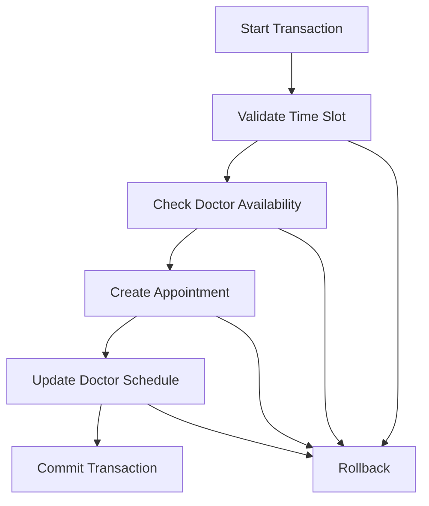
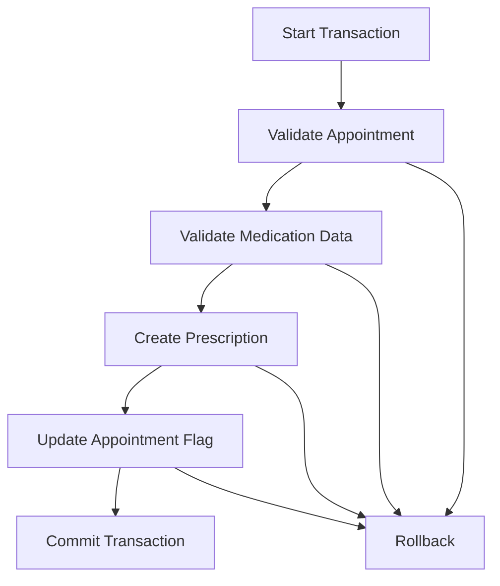

# ACID Transactions Implementation

This document describes the implementation of ACID (Atomicity, Consistency, Isolation, Durability) transactions in the appointment and prescription management system.

## Overview

The system implements ACID transactions using MongoDB's session and transaction support to ensure data consistency across related operations. The main transaction scenarios are:

1. Appointment Management
2. Prescription Creation and Management
3. Appointment-Prescription Relationship Management

## Transaction Implementation Details

### 1. Appointment Transactions

#### Key Operations
- Creating appointments
- Updating appointment status
- Managing doctor availability
- Handling concurrent bookings

#### Transaction Flow


#### Error Handling
- Time slot validation errors
- Doctor availability conflicts
- Concurrent booking conflicts
- Invalid status transitions

### 2. Prescription Transactions

#### Key Operations
- Creating prescriptions
- Updating appointment prescription flag
- Validating medication data
- Managing prescription status

#### Transaction Flow


#### Error Handling
- Invalid medication data
- Invalid expiry dates
- Unauthorized access attempts
- Concurrent prescription creation
- Appointment validation errors

## Implementation Details

### Error Handling

The system uses custom error classes for different types of errors:

```javascript
class PrescriptionError extends Error {
  constructor(message, code, context) {
    super(message);
    this.code = code;
    this.context = context;
  }
}

class ValidationError extends PrescriptionError {}
class TransactionError extends PrescriptionError {}
class AuthorizationError extends PrescriptionError {}
```

### Transaction Logging

The system implements detailed transaction logging:

```javascript
const transactionLogger = {
  start: (transactionId, operation) => {},
  success: (transactionId, operation, duration) => {},
  error: (transactionId, operation, error) => {},
  rollback: (transactionId, operation, reason) => {}
};
```

### Validation

The system implements comprehensive validation:

1. Medication Validation:
   - Required fields
   - Data type validation
   - Format validation

2. Date Validation:
   - Future dates
   - Reasonable ranges
   - Appointment relationship

## Testing

The system includes comprehensive tests for:

1. Basic CRUD operations
2. Error scenarios
3. Concurrent operations
4. Transaction rollback
5. Role-based access control

### Running Tests

```bash
npm test
```

## Best Practices

1. Always use transactions for related operations
2. Implement proper error handling
3. Use validation middleware
4. Log all transaction operations
5. Handle concurrent operations
6. Implement proper rollback mechanisms

## Error Codes

| Code | Description |
|------|-------------|
| VALIDATION_ERROR | Data validation failed |
| TRANSACTION_ERROR | Transaction operation failed |
| AUTHORIZATION_ERROR | Unauthorized access attempt |
| INVALID_MEDICATION | Invalid medication data |
| INVALID_EXPIRY | Invalid expiry date |
| CONCURRENT_MODIFICATION | Concurrent operation conflict | 